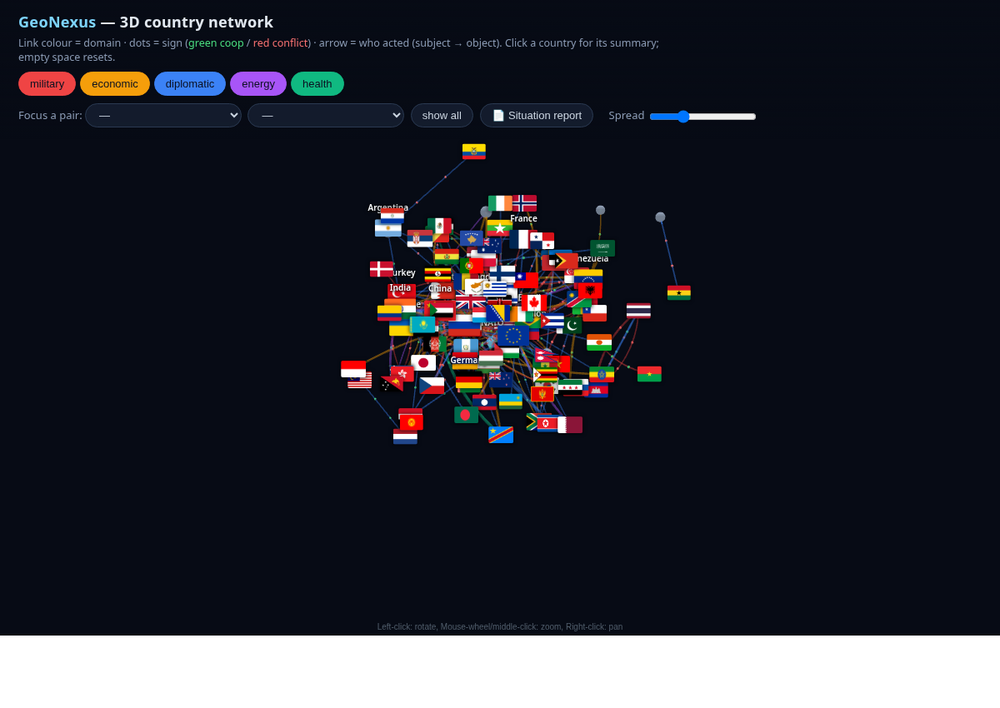

# GeoNexus

[](https://github.com/sebvicens2/geonexus/actions/workflows/ci.yml)
[](https://www.python.org/)
[](LICENSE)
[](https://mypy-lang.org/)
[](https://docs.astral.sh/ruff/)

> **A signed, multi-layer network of how countries relate — extracted from the
> news, navigable in 3D.**

GeoNexus turns ~weeks of news coverage into a **country-to-country relationship
graph**: who cooperates with whom, who is in conflict, in which **domain**
(military · economic · diplomatic · energy · health) — each tie **signed** and
**grounded** in the events behind it. You can fly through it in 3D, focus a pair,
read a cached LLM situation report, and track how the picture **shifts over time**.



---

## What you get

- **Signed multi-layer graph** — one layer per domain; each dyad carries a CAMEO
  quad-class (verbal/material × cooperation/conflict) mapped to a Goldstein-style
  sign. Built by a **local LLM** (Qwen via Ollama) reading daily news summaries.
- **20-year inertia** — a long-run baseline from **GDELT** (~2005+, net Goldstein
  tone) is reclassified into the **military / economic / diplomatic** strata and
  blended in: it anchors recent ties to their historical stance and keeps a
  persistent backbone where the news is quiet (energy/health stay news-only, as
  CAMEO has no such categories).
- **A hard maritime layer** — real chokepoints (Hormuz, Bab-el-Mandeb, Bosphorus…)
  with IMF-PortWatch disruption, alongside the media-derived news layers.
- **Signed-network analysis** — structural-balance %, faction split, tension
  triads, and **cross-layer divergence** (e.g. *China–US: rivals on
  military/economic/diplomatic, partners on energy/health*).
- **Grounded LLM situation reports**, cached — global, **per pair**, and **per
  country** — written as bullet points that explain the *reasons* (the source
  events), not the scores.
- **Temporal snapshots** — save the network daily and diff it (escalations,
  de-escalations, new/vanished ties, balance trend).
- **Interactive 3D view** — countries as **flags**, links coloured by domain with
  green/red particles for the sign and arrows for direction (subject → object),
  layer filters, pair focus, and a side panel of summaries.

---

## Quickstart

Needs [uv](https://docs.astral.sh/uv/) and a local [Ollama](https://ollama.com/)
(`qwen2.5:7b`) for the LLM steps.

```bash
uv sync --extra dev --extra viz

# 1. extract the signed multi-layer relations from World Observer summaries (LLM)
uv run python examples/extract_cameo.py
uv run python examples/extract_maritime.py          # hard maritime layer
uv run python examples/extract_gdelt_strata.py     # 20y inertia baseline per domain (from GDELT export)

# 2. cached situation reports — global / per pair / per country (LLM, grounded)
uv run python examples/synthesize_situation.py

# 3. the interactive 3D network
uv run python examples/build_country_network_3d.py  # → reports/geonexus_country_network_3d.html
```

Open `reports/geonexus_country_network_3d.html` in any browser (works from
`file://`; needs internet for the 3d-force-graph script). The flags are embedded,
so the view is otherwise self-contained.

---

## Reading the 3D network

| Channel | Meaning |
| --- | --- |
| **Node** | a country (its flag) or a bloc (coloured sphere) |
| **Link colour** | the **domain** — military · economic · diplomatic · energy · health |
| **Moving dots** | the **sign** — 🟢 cooperation / 🔴 conflict |
| **Arrow** | **direction** — who acted on whom (subject → object) |
| **Layer buttons** | toggle domains on/off (multi-select) |
| **Focus a pair** | keep only two countries + their direct ties |
| **Click a country** | fly to it, fade the rest; its summary loads in the panel |
| **Spread slider** | loosen / tighten the layout |

The same signed data also drives a static **multi-layer dashboard**
(`build_multilayer_dashboard.py`) — small-multiples per layer + divergence,
factions and chokepoint tables — and three flat views
(`build_country_views.py`: explorer / network / matrix).


---

## How it works

```
World Observer daily summaries
        │  extract_cameo.py            (Qwen: A | B | domain | CAMEO class -> sign)
        v
 data/world_observer_cameo.json        signed, directed, per-domain interactions
        │  multilayer.py               net stance per dyad/layer; balance; factions; divergence
        │  extract_maritime.py         chokepoints + PortWatch (hard layer)
        │  synthesize_situation.py     grounded LLM reports (global / pair / country), cached
        v
 build_country_network_3d.py           self-contained HTML (UMD 3d-force-graph + HTML overlay)
 snapshot_network.py -> network_evolution.py    dated snapshots + temporal diff
```

A small typed-graph core (`src/geonexus/`, Pydantic v2 + networkx, `mypy --strict`)
provides the `GeoNexus` graph object the analysis is built on; everything
network-specific lives in `examples/`.

---

## Honest caveats

- The news layers are **media-derived stance**, not ground truth — the report
  panels say so. Only the **maritime layer is hard data** (PortWatch).
- Relations are **LLM-extracted** (local Qwen) and imperfect; that's why every tie
  is **grounded** in its source sentence so you can check it.
- Faction blocs are a rough signed-partition heuristic on sparse data — the
  **balance %** and **tension triads** are the firmer signal.
- The graph is a **snapshot** (~ last 11 days); run `snapshot_network.py`
  regularly to build a real time series.

---

## Development

```bash
uv run ruff check .          # lint
uv run ruff format --check . # format
uv run mypy                  # strict types (core)
uv run pytest                # tests
```

CI runs the same gates on Python 3.11 & 3.12. MIT licensed.
