# EventGraph

[](https://github.com/sebvicens2/eventgraph/actions/workflows/ci.yml)
[](https://www.python.org/)
[](LICENSE)
[](https://mypy-lang.org/)
[](https://docs.astral.sh/ruff/)

> **A causal graph engine for geopolitical, economic and financial events.**

EventGraph represents **events**, **actors** and **assets** as a typed, directed
graph, links them with weighted causal relations, and then *reasons* over that
graph — tracing which assets an event can reach, ranking the most influential
players, and surfacing the most probable causal chains.

It is a small, standalone, well-typed library with no ties to any data pipeline.
Install it and use it from any Python project.

```python
from eventgraph import EventGraph, Actor, Asset, RelationType

g = EventGraph()
iran = g.add_actor(Actor(id="iran", name="Iran"))
gold = g.add_asset(Asset(ticker="XAU_USD"))
g.connect(iran, gold, RelationType.AFFECTS, weight=0.4)

g.impact("asset:XAU_USD")   # → ranked causal chains leading to gold
```

---

## Why EventGraph?

Most "event graphs" stop at *storing* relations. EventGraph is built as a small
**causal reasoning layer** — the graph is the substrate, the answers are the point.
It is designed to answer questions like:

- **Which assets** could be impacted by this event?
- **What are the plausible causal paths** from a cause to an asset?
- **Which actors** are the most connected / influential?
- **How far** does a node's influence radiate through the network?

Design principles:

- **Deterministic by default** — the MVP needs *no LLM*. Scores are reproducible
  and explainable (a path's score is just its discounted edge-weight product).
- **Typed and validated** — Pydantic v2 models, `mypy --strict`, `py.typed`.
- **Layered & extensible** — `core → ontology → graph → causality → storage/viz`.
  Each layer depends only on the ones below it, so narrative analysis, geopolitical
  scoring, temporal graphs or an LLM layer can be added *on top* without a rewrite.
- **Light dependencies** — `pydantic`, `networkx`, `matplotlib`. Interactive
  visualisation (`pyvis`) is an optional extra.

---

## Installation

```bash
pip install eventgraph            # core: pydantic, networkx, matplotlib
pip install eventgraph[viz]       # + interactive HTML export via pyvis
```

---

## Quickstart

```python
from datetime import datetime, timezone
from eventgraph import (
    EventGraph, Actor, Asset, Event, Relation,
    ActorType, AssetType, EventType, RelationType,
)

g = EventGraph()

# add nodes (each returns its namespaced node_id, e.g. "actor:iran")
iran = g.add_actor(Actor(id="iran", name="Iran", category=ActorType.COUNTRY))
gold = g.add_asset(Asset(ticker="XAU_USD", asset_class=AssetType.COMMODITY))
infl = g.add_event(Event(id="inflation", title="Inflation",
                         timestamp=datetime.now(timezone.utc),
                         event_type=EventType.MACRO))

# relate them (cause → effect, weighted 0..1)
g.add_relation(Relation(source=infl, target=gold,
                        relation_type=RelationType.AFFECTS, weight=0.75))

# explore
g.neighbors(gold, direction="in")        # ['event:inflation']
g.shortest_path(infl, gold)              # ['event:inflation', 'asset:XAU_USD']
g.centrality("betweenness")              # {node_id: score, ...}
g.influence_score(iran)                  # causal reach of a node

# reason
for path in g.impact("asset:XAU_USD"):
    print(path)                          # ranked causal chains → gold

# persist
g.save_json("graph.json")
g2 = EventGraph.load_json("graph.json")
```

---

## Example: Iran → Hormuz → Oil → Inflation → Gold

```python
g.impact("asset:XAU_USD", sources=["actor:iran"])
```

```text
Iran → Strait of Hormuz disruption → Oil supply risk → WTICO_USD → Inflation → XAU_USD  (score=0.168)
```

```text
Causal chains impacting XAU_USD (gold):
  inflation → XAU_USD                                              (score=0.750)
  WTICO_USD → inflation → XAU_USD                                  (score=0.446)
  oil_supply_risk → WTICO_USD → inflation → XAU_USD                (score=0.322)
  hormuz → oil_supply_risk → WTICO_USD → inflation → XAU_USD       (score=0.219)
  iran → hormuz → oil_supply_risk → WTICO_USD → inflation → XAU_USD (score=0.168)

Most influential nodes (causal reach):
  Iran                         2.385
  Strait of Hormuz disruption  1.941
  Oil supply risk              1.678
```

Run the full demo:

```bash
python examples/iran_oil_gold.py
```

### How the score works

A chain's score is the **product of its edge weights**, discounted by a per-hop
`decay` factor (default `0.85`) so shorter, stronger chains rank above long,
speculative ones:

```
score = (w₁ · w₂ · … · wₙ) · decay^(n-1)
```

`impact(target)` enumerates every chain that ends at `target` and returns them
ranked by score. `influence_score(node)` sums the best forward-path scores from a
node to all of its descendants.

---

## Visualisation

`draw()` renders the graph with matplotlib (a core dependency) — enough for any
demo or notebook. Nodes are coloured by kind: **event** (red), **actor** (blue),
**asset** (green).

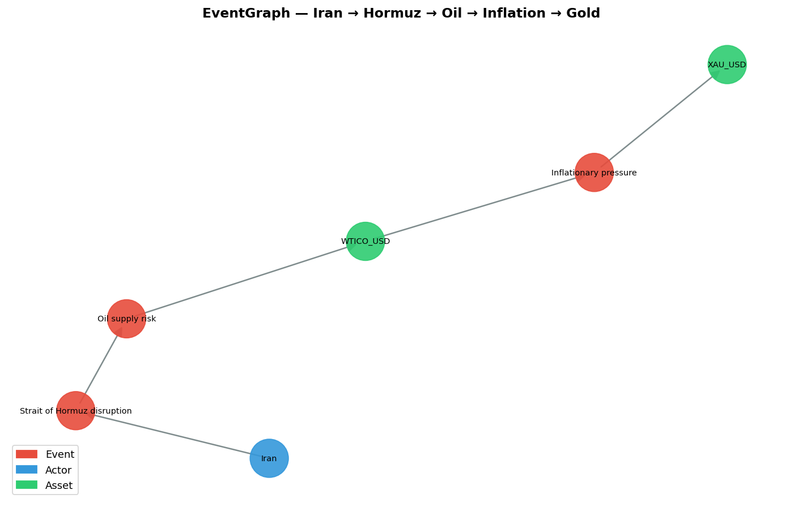

```python
from eventgraph.visualization import draw, export_html, export_graphml

draw(g)                          # → matplotlib Axes
export_html(g, "graph.html")     # interactive (requires eventgraph[viz])
export_graphml(g, "graph.graphml")  # → Gephi / yEd
```

---

## Features

| Area | What you get |
| --- | --- |
| **Domain model** | `Event`, `Actor`, `Asset`, `Relation` — Pydantic v2, validated, JSON-ready |
| **Ontology** | Controlled vocabularies: `EventType`, `ActorType`, `AssetType`, `RelationType` |
| **Graph** | `EventGraph` over a `networkx.MultiDiGraph`: `add_*`, `get`, `neighbors`, `shortest_path` |
| **Metrics** | `centrality` (degree / betweenness / closeness) + `influence_score` (causal reach) |
| **Causality** | `impact(target)` — deterministic, ranked, explainable causal chains |
| **Analytics** | `emerging_clusters()` (Louvain communities) + `risk_hotspots()` (centrality × influence × density) |
| **Temporal** | `EventMemory`: dated snapshots, `compare_hotspots()` & `compare_clusters()`, hotspot evolution plot |
| **Storage** | In-memory + JSON backends behind a `Storage` protocol; canonical (deterministic) serialisation |
| **Visualisation** | matplotlib (core) · pyvis interactive HTML (extra) · GraphML export |
| **Quality** | `mypy --strict`, `ruff`, `py.typed`, ~96% test coverage, CI on 3.11 & 3.12 |

---

## Real-world demo: World Observer

To show EventGraph on a live feed rather than a toy, `examples/` includes an
experimental integration with [World Observer](https://github.com/) — a corpus of
analysed geopolitical articles (countries, actors, theatres, categories,
importance, dates, plus WO's LLM-flagged `entities_to_watch` as a lightweight
forward-looking signal). The integration is **read-only and one-directional**: a
single script exports a real sample to JSON; the library never depends on World
Observer, and EventGraph itself runs no LLM.

```bash
python examples/world_observer_demo.py   # text report
python examples/world_observer_map.py    # → world_observer_graph.png / .html
python examples/results_report.py         # full report → reports/world_observer_results.md
```

A full generated report (overview, influence, hotspots, clusters, causal paths to
assets) lives at [`reports/world_observer_results.md`](reports/world_observer_results.md).

### Self-contained HTML dashboard

```bash
python examples/build_dashboard.py   # → reports/eventgraph_dashboard.html
```

One self-contained file (interactive pyvis network inlined — no server, no app,
works offline). Tabs for overview, network, clusters, hotspots and causal paths —
a prototype for a future World Observer tab.

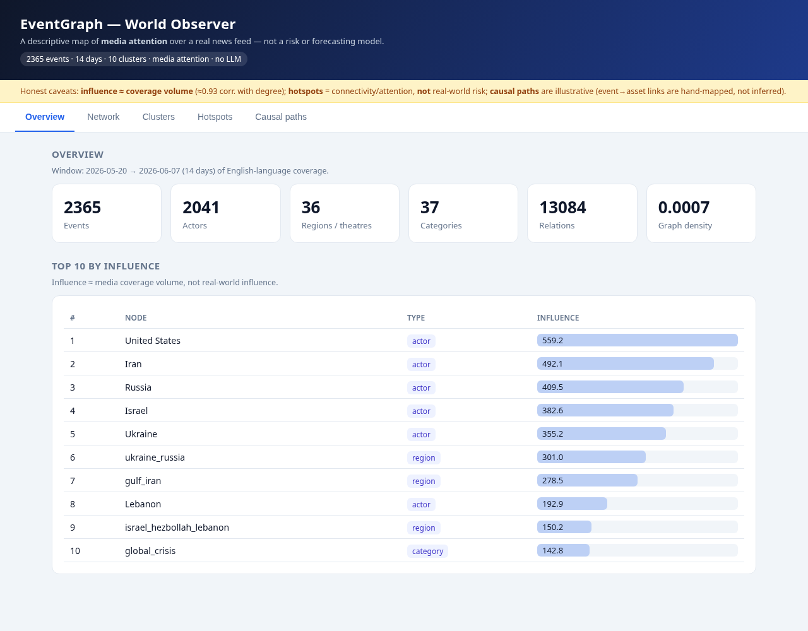
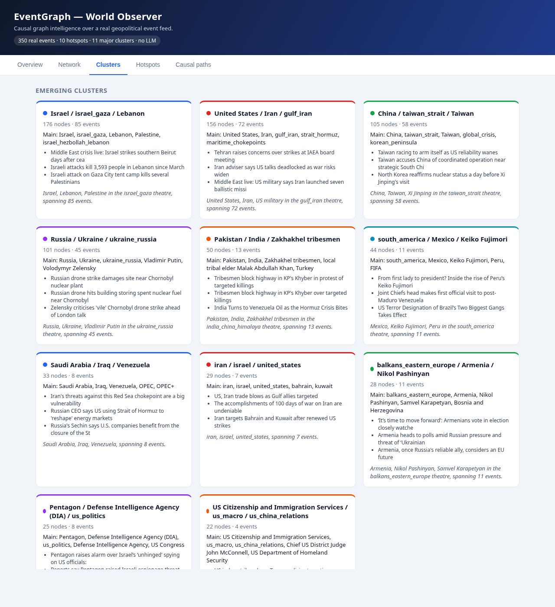

From **2,365 real events** (a 14-day window), the graph (~4,500 nodes) surfaces —
with no LLM and no hand-tuning — the structure of the news cycle:

```text
Top by influence (≈ media coverage volume)
  United States  Iran  Russia  Israel  Ukraine  ukraine_russia  gulf_iran …

Emerging clusters (media co-occurrence)
  Cluster 1: United States, Iran, gulf_iran, strait_hormuz, maritime_chokepoints
  Cluster 2: Israel, israel_gaza, Lebanon, Palestine, israel_hezbollah_lebanon
  Cluster 3: Russia, Ukraine, ukraine_russia, Vladimir Putin, Volodymyr Zelensky
  Cluster 4: China, taiwan_strait, Taiwan, korean_peninsula, global_crisis

Top attention hotspots (connectivity / attention — NOT real-world risk)
  United States  0.819   Iran  0.728   Russia  0.602   Israel  0.590
```

> **Honest caveats.** These metrics describe **media attention**, not real-world
> risk or causality. *Influence* ≈ coverage volume (it correlates ~0.93 with raw
> degree); *hotspots* measure connectivity, not risk; the *causal paths* in the
> report attach assets via a hand-mapped heuristic and are **illustrative, not
> predictive**. The sample is 14 days of English-language coverage.

The four largest communities still cleanly recover the four live theatres —
Middle East, Iran/Gulf, Russia/Ukraine and Asia-Pacific — from co-occurrence alone:

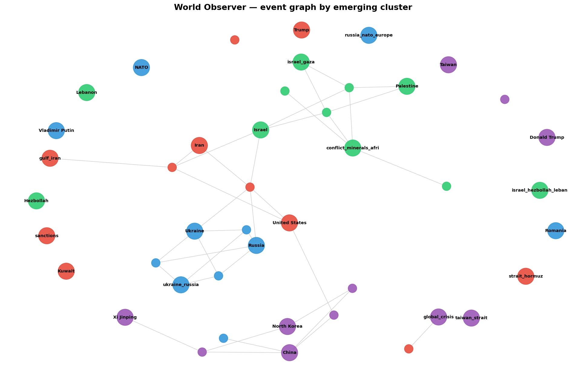

### Consuming WO's synthesis layer (recommended)

World Observer already computes, on a schedule, per-country / per-theatre
intelligence: instability scores, attention shares, narratives and LLM summaries.
Rather than re-deriving a weaker "attention" from raw articles, EventGraph can
**consume those scores as node attributes** and add the relational layer WO lacks
— a country co-occurrence graph, communities (blocs) and connectivity ranking.

```bash
python examples/extract_world_observer_synthesis.py   # → data/world_observer_synthesis.json
python examples/world_observer_synthesis.py           # report → reports/world_observer_synthesis.md
python examples/build_synthesis_dashboard.py          # → reports/eventgraph_synthesis_dashboard.html
```

This is the honest division of labour: **ranking by WO's real instability &
attention** (not a recomputed proxy), with EventGraph contributing structure —
e.g. the US is the most *connected* country (it bridges theatres) though far from
the most *unstable*, and co-occurrence communities surface real blocs (Gulf/Iran,
Russia/Ukraine/Baltics, the Sahel…) ranked by mean WO instability.

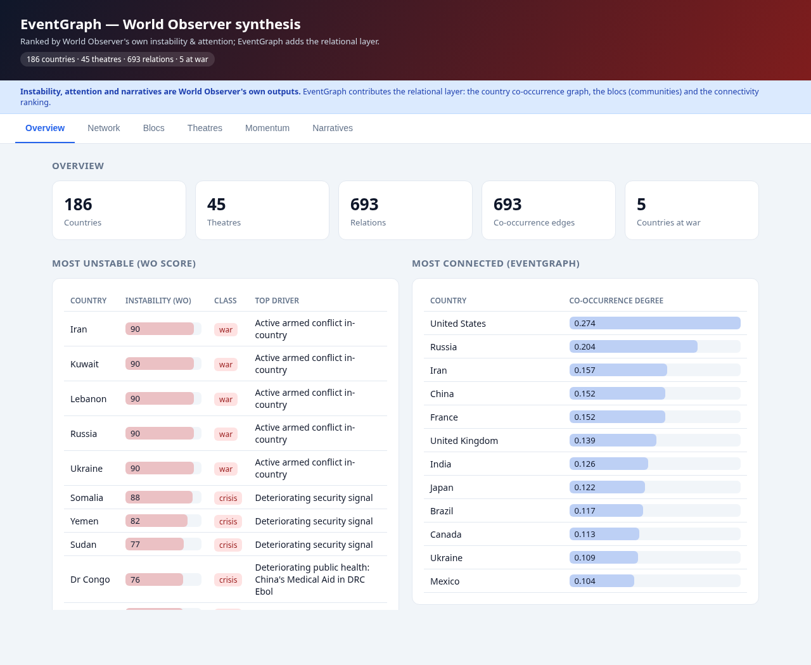

### Narrative evolution — where the genuinely new signal is

The static instability scores and the co-occurrence graph mostly recover the
obvious. The interesting signal turned out to be the **drift of WO's LLM
narratives over time** — which topics *enter*, *fade* or *persist* in each
country/theatre synthesis. Topics are extracted deterministically from the
summary bullets (no LLM); one graph per day is stored in an `EventMemory` and
diffed.

```bash
python examples/extract_world_observer_narrative_history.py  # versioned LLM summaries → JSON
python examples/narrative_evolution.py                        # → reports/world_observer_narrative_evolution.md
```

Real, interpretable output (10-day window):

```text
[gulf_iran]   + entered: Bahrain, Kuwait, China, Belt & Road, Supreme Leader
              - faded:   IRGC, South Korean         (the conflict widens to the Gulf)
[ukraine_russia] + entered: Chornobyl, IAEA, Zaporizhzhia, Black Sea   (nuclear-site dimension)
[israel_gaza]    + entered: Bab-el-Mandeb, West Bank, Egypt            (spread to the Red Sea)

Entering the world narrative (across 197 country/theatre/category narratives):
  14 entities  Ebola       ← a weak signal rising across many narratives at once
  14 entities  World Cup    8 entities  Gaza, Security Council …
```

The `Ebola` rollup is the kind of cross-cutting weak signal no single-entity view
or instability score surfaces — it only appears by diffing the narrative content
across entities over time.

**Day by day**, the tracker dates *when* each topic enters, with a sparkline of
how many narratives carry it, plus a chronological feed and per-entity timelines:

```text
Rising topics (dated)
  Ebola       first seen 2026-05-27   1 → 9 entities   ▁▃▂▁▇█████   ← breakout ~06-01
  West Bank   first seen 2026-06-06   0 → 4 entities          ▂▄
  Beirut      first seen 2026-05-28   0 → 4 entities    ▁ ▄▂▁   ▄

Chronological feed (first crossing into 2+ narratives)
  2026-05-31  Zaporizhzhia, IAEA, Beaufort Castle      ← nuclear angle enters
  2026-06-05  Bab, Mandeb (Bab-el-Mandeb), Shangri-La  ← Red Sea chokepoint enters
  2026-06-07  Chornobyl, Nordic

Entry timeline — gulf_iran
  2026-05-28 + Oil, Merchant      2026-06-01 + China, Kuwait
  2026-06-04 + Bahrain            2026-06-05 + Belt & Road, Supreme Leader
```

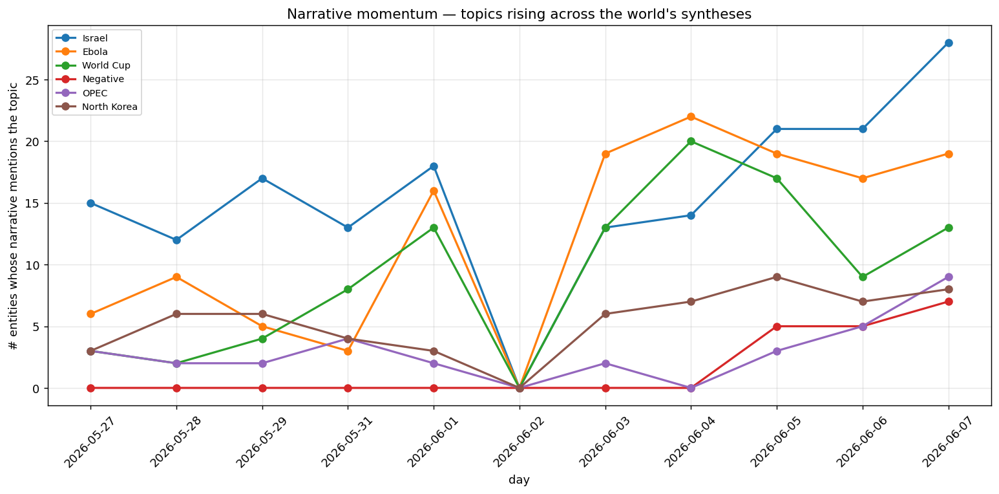

A self-contained HTML dashboard puts it all together. Its headline tab is an
**Emerging-signals board** — denoised, ranked by surprise: each card is a topic
that was ~absent early and surged, with the day it broke out, how many of the 197
narratives now carry it, a trajectory sparkline, and where it spread. (Other tabs:
momentum chart, dated rising topics, chronological feed, per-entity timelines.)

```bash
python examples/build_narrative_dashboard.py   # → reports/eventgraph_narrative_dashboard.html
```

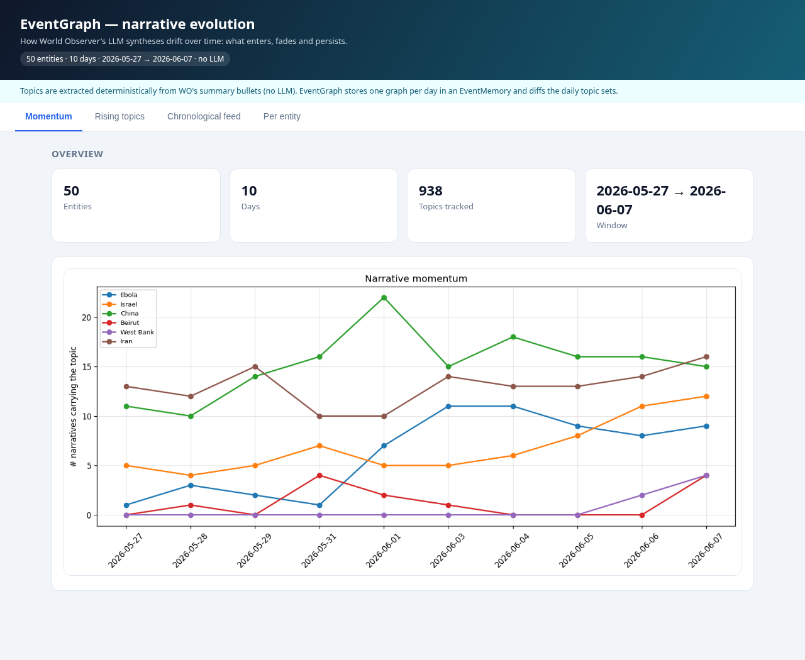

#### Optional: a grounded LLM brief

The detection above is fully deterministic. As an *optional* last mile, a local
Qwen (Ollama) can explain the top signals — one grounded sentence each, written
from the actual before/after WO summaries (temperature 0, told to use only facts
in the text), bounded to the top-N signals:

```bash
python examples/narrative_llm_brief.py --model qwen2.5:14b --top 8
```

```text
▲ OPEC    OPEC+ agreed to a fourth oil-output increase amid the Strait of Hormuz crisis and UAE's exit.
▲ WHO     Health workers treat Ebola patients unpaid as the WHO seeks resources — a critical funding gap.
▲ Bahrain Iran launches missile and drone attacks on Bahrain, escalating Gulf tensions.
```

EventGraph itself stays LLM-free; this enrichment lives in `examples/` and
degrades gracefully if Ollama isn't running. Detection is reproducible; the
LLM interpretation layer is not.

#### Relating signals into chains

Signals that surface in the same narratives are linked into **chains** — built
deterministically as connected components of a signal graph (EventGraph used on
its own output). With `--llm`, a local Qwen names each storyline and explains how
the pieces connect, grounded in the per-signal explanations:

```bash
python examples/build_narrative_dashboard.py --llm --model qwen2.5:7b
```

> *"An Ebola outbreak in Congo has led to border closures in Uganda, prompting the
> WHO to seek international support, and drawing attention to broader impacts
> across Central Africa."* — chain: Uganda + WHO + Central Africa

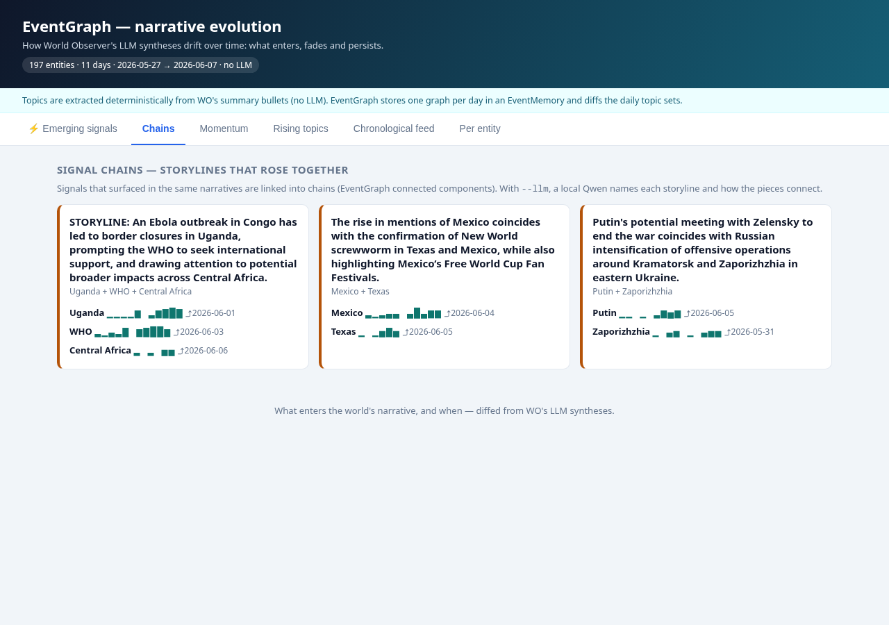

#### Hidden links: a typed relation graph (LLM-extracted)

Chains and co-occurrence only connect things that share a narrative — and plain
co-occurrence/PMI mining turned out to be mostly noise (split names, definitional
pairs). The approach that actually works is **relation extraction**: a local Qwen
pulls explicit `SUBJECT | RELATION | OBJECT` triples from each summary, which build
a typed relation graph in EventGraph. Multi-hop queries then return *real stated
relations*, not statistical co-occurrence.

```bash
python examples/extract_relations.py                 # → data/world_observer_relations.json (LLM)
python examples/relation_graph.py                    # hubs + example chains
python examples/relation_graph.py --between China Ukraine
```

```text
China → Ukraine:  China —[competes with]→ Russia —[supports]→ Ukraine
Iran  → Israel:   Iran —[condemned]→ Israel
Stated: Canada —[bans]→ Texas cattle · Russia —[attacks]→ Ukrainian nuclear waste facility
```

It's the **Relations** tab in the narrative dashboard (direct relations only, each
grounded in its source sentence — extraction is LLM-based and imperfect, so the
grounding lets you verify it; no multi-hop chains, because relations don't compose).

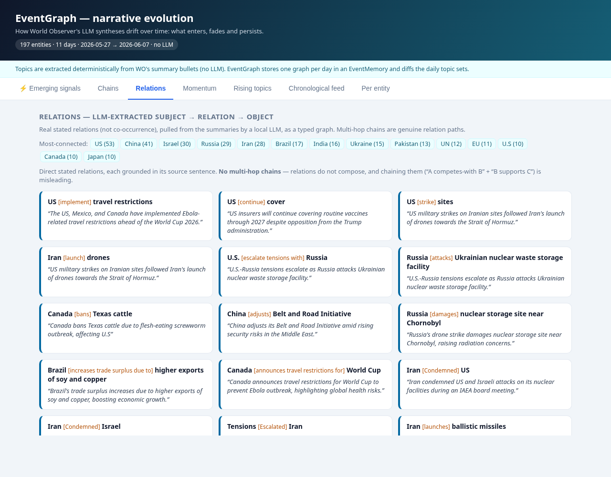

The same relations render as an **interactive network** — each edge is one grounded
fact (hover for the verb), showing the connected core (degree-1 leaves hidden):

```bash
python examples/relation_network.py   # → reports/eventgraph_relation_network.html
```

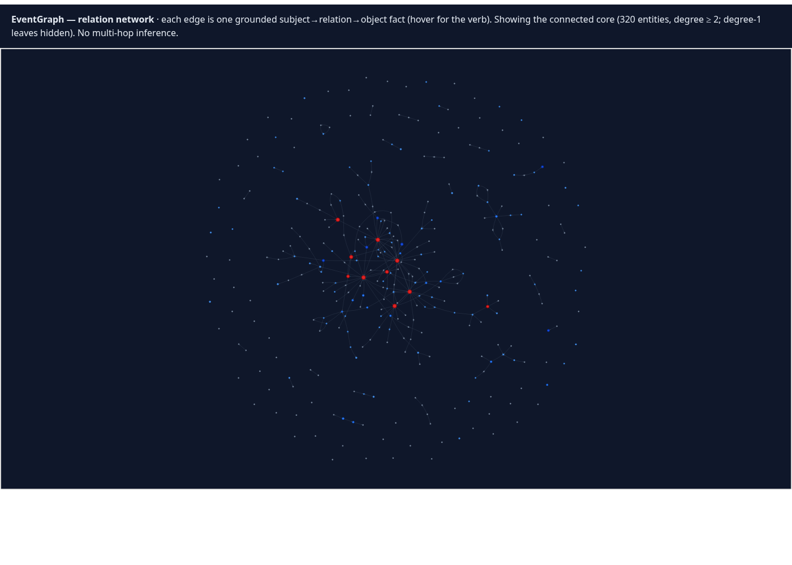

### Multi-layer geopolitical network (signed news + hard maritime)

A multiplex country network where the same nodes carry several **layers**, and
news edges are **signed** by stance (CAMEO quad-classes → Goldstein sign):

```bash
python examples/extract_maritime.py   # hard layer: chokepoints + PortWatch disruption
python examples/extract_cameo.py      # signed news layers (LLM): A | B | domain | CAMEO class
python examples/multilayer.py         # → reports/world_observer_multilayer.md
```

- **News layers** (military / economic / diplomatic / energy / health): country↔country
  edges signed −2…+2 (material/verbal × conflict/cooperation). Media-derived stance.
- **Hard maritime layer**: chokepoint nodes (Hormuz, Bab-el-Mandeb…) with *real*
  IMF-PortWatch disruption (z-score), linked to their theatre's countries.

The payoff is **cross-layer divergence** — only a multi-layer view shows it:

```text
China – United States:  military -1, economic -1, diplomatic -1, energy +2, health +1
Canada – United States: economic -2, diplomatic +3
Maritime: Hormuz/Gulf of Oman [oil] → Iran, United States, Israel, Kuwait …
```

Honest split: the news layers are *reported stance* (LLM-classified, imperfect);
PortWatch is hard data. EventGraph's `MultiDiGraph` carries the parallel typed
layers natively.

It all comes together in a dashboard — small-multiples (one signed network per
layer, green = cooperation / red = conflict) + the maritime layer, plus
**signed-network analysis** (structural-balance % and a faction split on the
military+diplomatic alignment, à la "enemy of my enemy"):

```bash
python examples/build_multilayer_dashboard.py   # → reports/eventgraph_multilayer_dashboard.html
```

Actors are normalised and filtered to real countries/blocs (junk like "World Cup
organizers" dropped). Honest caveat: faction blocs are a rough heuristic on sparse
data — the structural-balance score and tension triads (e.g. Iran–US–Israel) are
the firmer signal.

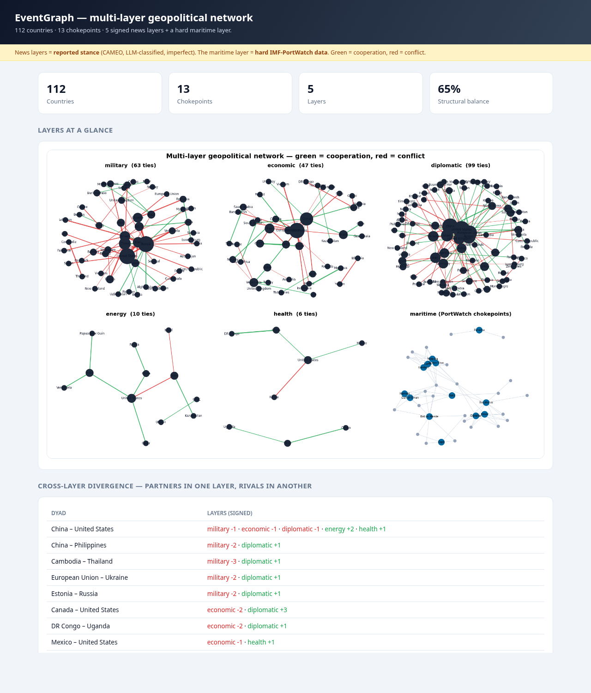

To actually *read* the connections between countries, `build_country_views.py`
gives three legible, interactive views in one file — pick whichever fits:

- **Explorer** — select a country, see all its ties per layer (signed, coloured);
- **Network** — labelled interactive graph, filter by layer, click a country to focus;
- **Matrix** — country x country grid, cell = net stance, filter by layer.

```bash
python examples/build_country_views.py   # → reports/eventgraph_country_views.html
```

For a navigable view, an **interactive 3D multiplex** stacks each layer as a plane
(country at the same x,y on every plane; green/red intra-layer ties; vertical
links couple a country across layers) — drag to rotate, scroll to zoom:

```bash
python examples/build_multilayer_3d.py   # → reports/eventgraph_multilayer_3d.html (WebGL)
```

### Tracking change over time with `EventMemory`

`EventMemory` stores a dated graph snapshot per day and diffs them. Over a 14-day
window it detects **which hotspots appear, intensify or fade** and **which crises
emerge, persist or dissolve**:

```bash
python examples/world_observer_timeline_demo.py   # → world_observer_timeline.png
```

```text
Hotspot changes  2026-05-20 → 2026-06-07
  ▲ Israel          intensified  0.43 → 0.82
  ▲ taiwan_strait   appeared     0.00 → 0.30
  ▲ Palestine       appeared     0.00 → 0.28
  ▼ Russia          faded        0.77 → 0.37
  ▼ NATO            disappeared  0.26 → 0.00

Cluster changes  2026-05-20 → 2026-06-07
  + EMERGED    United States, Iran, gulf_iran   (Iran–Hormuz–oil nexus crystallised)
  = PERSISTED  Ukraine, Russia, ukraine_russia
  = PERSISTED  Israel, Lebanon, israel_hezbollah_lebanon
```

```python
from eventgraph import EventMemory

mem = EventMemory("snapshots/")          # optional on-disk persistence
mem.snapshot("2026-06-07", graph)
mem.compare_hotspots("2026-05-20", "2026-06-07")   # appeared / intensified / faded
mem.compare_clusters("2026-05-20", "2026-06-07")   # emerged / persisted / dissolved
```

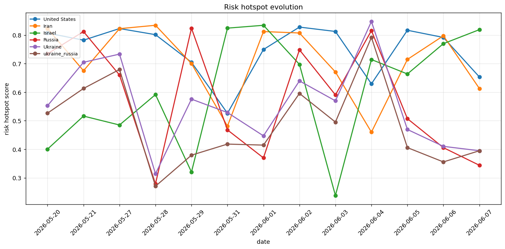

---

## Roadmap — Phase 2

The core is deliberately minimal. Planned work builds *on top* of it without
touching the existing layers:

- **Event similarity** — embed/compare events to answer *"what looks like this?"*
- **Temporal graphs** — ✅ shipped as `EventMemory` (dated snapshots, hotspot/cluster
  diffs); next: weak-signal detection and trend forecasting on the series.
- **Geopolitical scoring** — actor/region risk metrics derived from graph structure.
- **Market-impact modelling** — turn causal chains into directional asset signals.
- **Narrative analysis** — cluster and contrast competing narratives over events.
- **Optional LLM layer** — assisted relation extraction and chain explanation,
  strictly additive to the deterministic core.

---

## Development

This project uses [uv](https://docs.astral.sh/uv/), `ruff`, `mypy` and `pytest`.

```bash
# set up an isolated environment with all extras
uv sync --extra dev --extra viz

# lint, format-check, type-check, test
uv run ruff check .
uv run ruff format .          # use --check in CI
uv run mypy
uv run pytest                 # coverage is on by default

# build distributables
uv build
```

CI runs the same checks on Python **3.11** and **3.12** (see
[`.github/workflows/ci.yml`](.github/workflows/ci.yml)).

### Project layout

```
src/eventgraph/
├── core/          # Event, Actor, Asset, Relation (pydantic models)
├── ontology/      # controlled vocabularies (event/actor/asset/relation types)
├── graph/         # EventGraph — the public API over networkx
├── causality/     # propagation + scoring (the reasoning engine)
├── storage/       # in-memory & JSON backends (Storage protocol)
└── visualization/ # matplotlib (default) + pyvis (optional) + GraphML
```

---

## License

[MIT](LICENSE) © Sebastien Vicens
